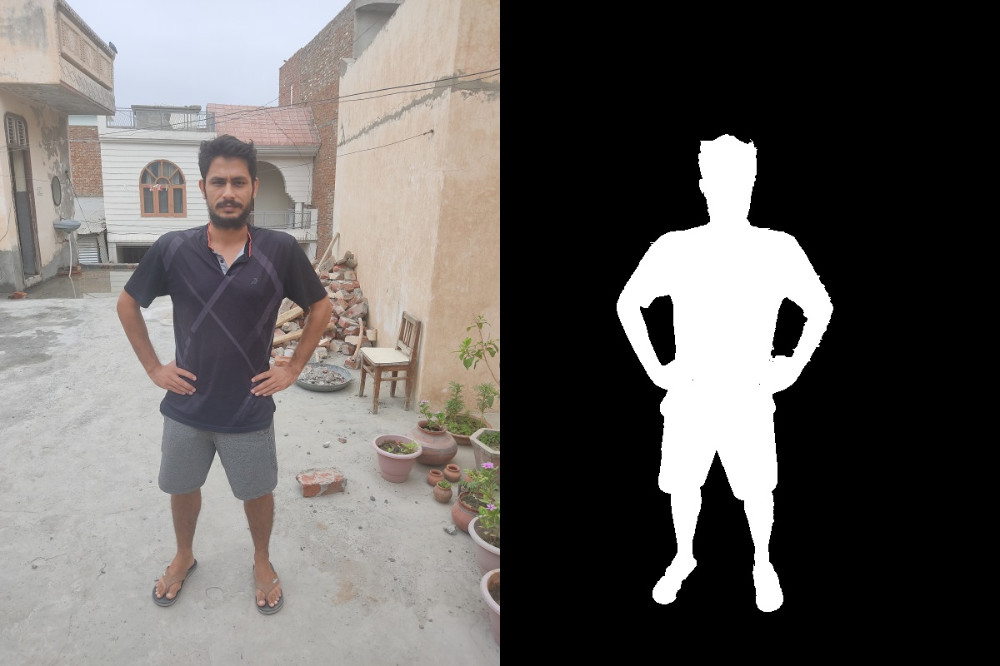

# Human in loop grab cut based foreground extraction
Extracting foreground regions in image plane is very basic and primary task for many complex computer vision tasks. Extracting foreground parts from images includes extracting human part or any desired objects from the images. Grab Cut algorithm is one of the most popular method in the field of image segmentation. Grab Cut is an iterative method. Further, the addition of manual seed points can boost the performance of the grab cut algorithm. One can directly use the Grabcut algorithm using OpenCV APIs but manually adding seed points for GrabCut is not straight forward. Hence, this repo aims at developing a pipeline to manually add the seed points (which includes marking of background region and foreground regions) in the image to extract the foregroiund regions. More specifically this repo aims at extracting the single human extraction in the images. The code in this repo for human extraction part consists of three steps.
* Grab cut initialization with a image size bounding box.
* Extract the human segmentation part using the repository [Self Correction for Human Parsing](https://github.com/PeikeLi/Self-Correction-Human-Parsing) and use the output of network as seed point for GrabCut algorithm.
* A user friendly interface for manually marking of the seed points for a good foreground mask.


## Environment setting using Miniconda
1. Install [Miniconda](https://docs.conda.io/en/latest/miniconda.html)
2. Clone this repository
3. `cd \path\to\the\repository`

```
conda update -n base -c defaults conda
conda env create -f environment.yaml
conda activate v360
```


**Steps**
* Put your test images in the folder `/images`
* To extract the foreground, type in the terminal `python3 main.py`
* A user friendly interface will be up for manually marking of seed points.
* A [video link](https://youtu.be/LQEW0-63WV4) is attached which demostrates how to mark the seed points (foreground and background pixels).
* Segmented part will be saved in the folder `/foreground_mask` and concatanated images will be saved in the folder `/final_image`.


<p align="center">
  
</p>


**Observations**
* Good for offline processing as grab cut takes sufficient computation time.
